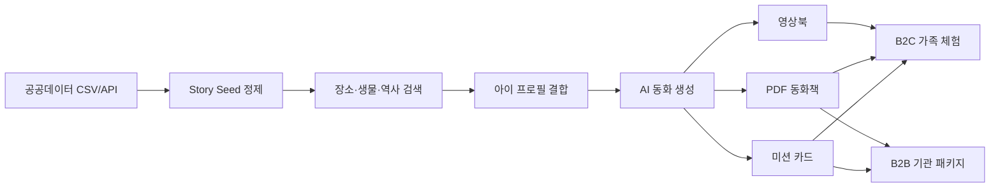

# Jaramgeul

부산 특화 공공데이터를 활용해 아이의 생활권, 바다, 문화공간, 역사 장소를 맞춤 동화책으로 바꾸는 AI 동화책 서비스 실험 프로젝트다.

## 핵심 아이디어

**Busan StoryMap AI**는 아이의 나이와 관심사에 공공데이터 기반 장소·생물·역사 정보를 결합해, 방문 전 예습 동화, 현장 미션, 방문 후 기념 동화책을 생성하는 서비스다.

단순히 AI가 임의로 동화를 만드는 것이 아니라, 공공데이터가 제공하는 실제 장소, 운영 정보, 좌표, 기관 정보, 해양생물 정보, 문화유산 설명을 이야기의 근거로 사용한다.

## 서비스 한 줄 정의

부산의 공원, 도서관, 박물관, 관광지, 해양생물, 문화유산 데이터를 아이의 언어로 번역해 가족의 오늘 방문 경험을 동화책과 활동지로 만들어주는 AI 스토리맵 서비스.

## 왜 공공데이터가 필요한가

이 서비스에서 공공데이터는 장식용 근거가 아니라 생성 결과의 입력값이다.

| 데이터 역할 | 서비스에서 바뀌는 것 | 예시 |
| --- | --- | --- |
| 장소 선택 | 아이 주변에서 갈 만한 장소 카드 | 공원, 도서관, 박물관, 관광지 |
| 이야기 배경 | 실제 장소명이 들어간 맞춤 동화 | “영도 바닷가 박물관으로 떠나는 이야기” |
| 활동 미션 | 장소 시설·전시·유산 특징 기반 미션 | “입구에서 배 모양 표식을 찾아보기” |
| 과학 소재 | 해양생물 캐릭터와 퀴즈 | 미역, 물고기, 해양생물 생태 설명 |
| 역사 소재 | 문화유산 탐방 동화 | 피란수도, 근대 건축, 국가유산 이야기 |
| 기관 제휴 | B2B 납품 후보 리스트 | 도서관, 박물관, 관광기관, 지자체 |

## 현재 확보한 데이터

현재 데이터는 CSV 우선으로 확보하고, 서비스에서 바로 쓰기 쉬운 `story seed` 형태로 백필한다. 원본과 정제 CSV는 [data](./data) 디렉토리에서 관리한다.

| 축 | 데이터 | 현재 쓰임 |
| --- | --- | --- |
| 생활권 장소 | 전국도시공원정보표준데이터 | 우리 동네 동화 배경, 어린이공원 미션 |
| 생활권 장소 | 전국도서관표준데이터 | 도서관 동화, 작은도서관 기관 제휴 |
| 문화공간 | 전국박물관미술관정보표준데이터 | 박물관·미술관 관람 전후 동화 |
| 관광 | 전국관광지정보표준데이터 | 탐방형 동화, 관광기관 협력 |
| 해양 | 해양생물 채집 공간정보 | 바다 생물 캐릭터, 해양 퀴즈 |
| 해양 | 해양생물종정보 서비스 | 생물 설명문, 과학 지식 보강 |
| 역사 | 전국향토문화유적표준데이터 | 동네 역사 이야기 |
| 역사 | 국가유산청 국가유산 검색 Open API | 부산 국가유산 탐방 동화 |

세부 URL, 컬럼, 저장 경로는 [data/public-data-catalog.md](./data/public-data-catalog.md)에 정리한다.

## 1차 서비스 구체화

첫 MVP는 **부산 특화 우리 동네 동화책**으로 좁힌다.

사용자는 아이 프로필과 관심사를 입력하고, 부산의 장소 데이터를 기반으로 동화 배경을 고른다. AI는 선택된 장소의 이름, 주소, 유형, 소개, 시설, 문화·해양 키워드를 조합해 아이가 읽을 수 있는 짧은 동화와 미션 카드를 만든다.

### MVP 흐름

1. 아이 프로필 입력: 나이, 관심사, 읽기 수준
2. 장소 선택: 공원, 도서관, 박물관, 관광지, 문화유산
3. 데이터 기반 이야기 생성: 장소 정보와 해양·역사 키워드를 동화로 변환
4. 미션 카드 생성: 방문 중 관찰 질문과 활동 미션 제공
5. 결과물 저장: PDF 동화책, 영상북, 활동지로 확장

### MVP 화면 후보

| 화면 | 필요한 데이터 | 설명 |
| --- | --- | --- |
| 동네/장소 선택 | 공원, 도서관, 박물관, 관광지 좌표·주소 | 아이 주변 또는 부산 구·군별 장소 선택 |
| 장소 카드 | 장소명, 소개, 운영 정보, 편의시설 | 부모가 방문 전 확인하는 카드 |
| AI 동화 생성 | 장소 요약, 키워드, 아이 프로필 | 장소가 실제 배경으로 들어간 동화 생성 |
| 미션 카드 | 시설, 전시, 유산 설명, 해양생물 특징 | 현장에서 수행할 관찰 미션 |
| 결과 보관함 | 생성 결과, 선택 장소, 이미지·음성 자산 | PDF·영상북·실물책 상품화 |

## 공공데이터 연계 서비스 구조

## 사업화 방향

초기에는 B2C 가족 체험으로 사용 장면을 검증하고, 반복 매출은 기관 패키지로 확장한다.

| 모델 | 고객 | 상품 | 수익화 |
| --- | --- | --- | --- |
| B2C 체험 | 부산 거주 가족, 부산 여행 가족 | 장소 기반 맞춤 동화, 미션 카드, PDF | 건별 구매, 월 구독 |
| B2C 기념품 | 방문 후 기록을 남기려는 가족 | 사진·이름이 들어간 기념 동화책 | 실물책 주문, 영상북 렌더링 |
| B2B 기관 | 도서관, 박물관, 관광기관 | 기관 장소 기반 동화·활동지 패키지 | 기관 라이선스, 행사형 납품 |
| B2G/B2P | 지자체, 관광공사, 문화기관 | 지역 캠페인형 스토리맵 콘텐츠 | 파일럿 사업, 콘텐츠 용역 |

## 확장 가능안

확장은 새 아이디어를 무리하게 늘리는 방식이 아니라, 같은 데이터 파이프라인에서 상품 표면만 넓히는 방식으로 진행한다.

| 확장안 | 설명 | 추가로 필요한 것 |
| --- | --- | --- |
| 전국 우리 동네 동화 | 부산에서 검증한 장소 기반 동화 생성 구조를 전국 공원·도서관·박물관으로 확장 | 전체 페이지 수집, 지역 검색 UI |
| 해양 생물 탐험 동화 | 해양생물 데이터를 캐릭터와 과학 퀴즈로 바꿔 바다 테마 시리즈 제작 | 생물 이미지·라이선스 검토, 난이도별 설명문 |
| 역사 속 주인공 | 관광지·향토문화유적·국가유산 데이터를 탐방형 역사 동화로 변환 | 국가유산 이미지 공공누리 유형 확인 |
| 기관용 체험 콘텐츠 | 도서관·박물관·관광기관이 행사나 교육 프로그램에 쓰는 활동지 패키지 | 기관 로고/행사명 템플릿, PDF 출력 |
| 영상북·실물책 상품 | 같은 원고를 PDF, 오디오북, 영상북, 인쇄 파일로 변환 | 이미지·음성 싱크, 인쇄용 레이아웃 |

## 우선순위

1. 부산 장소 기반 동화 생성 MVP를 만든다.
2. CSV story seed를 검색 가능한 JSON/API로 변환한다.
3. 장소 선택, 동화 생성, 미션 카드 화면을 만든다.
4. PDF·영상북 결과물을 붙여 상품성을 확인한다.
5. 도서관·박물관·관광기관용 B2B 샘플 제안서를 만든다.

## 현재 개발 메모

- 데이터는 `data/raw/csv`와 `data/processed/csv`에 쌓는다.
- `processed` CSV는 AI 프롬프트와 화면에 바로 쓰는 `story seed`다.
- 현재는 CSV 우선이며, DB 적재는 검색·MVP 화면 구조가 잡힌 뒤 진행한다.
- 공공데이터포털 API는 [scripts/data/public_data_pipeline.py](./scripts/data/public_data_pipeline.py)에서 관리한다.
- 국가유산청 자체 XML API는 [scripts/data/khs_heritage_pipeline.py](./scripts/data/khs_heritage_pipeline.py)에서 관리한다.
